# Quickscope Terminal — Data Sources Connection Map

> Visual architecture showing how the frontend connects to all data sources.

---

## High-Level Architecture

```mermaid
graph TB
    subgraph Client["Frontend (React + RTK Query)"]
        direction TB
        UI[UI Components / Screens]
        RTK[RTK Query Cache]
        WS_Client[WebSocket Client]
        Redux[Redux Store]
    end

    subgraph QS_Backend["QS Backend (VITE_API_HOST)"]
        direction TB
        AUTH_MOD["/auth/ module"]
        PUBLIC_MOD["/public/ module"]
        PRIVATE_MOD["/private/ module"]
        TX_MOD["/tx/ module"]
    end

    subgraph External["External Services"]
        JUP["Jupiter API\nlite-api.jup.ag"]
        SOL_RPC["Solana RPC\nVITE_SOLANA_RPC_ENDPOINT"]
    end

    subgraph QS_WS["QS WebSocket (VITE_WS_HOST/public)"]
        WS_SERVER[WebSocket Server]
    end

    UI --> RTK
    RTK -- "POST /{module}/?method=..." --> AUTH_MOD
    RTK -- "POST /{module}/?method=..." --> PUBLIC_MOD
    RTK -- "POST /{module}/?method=..." --> PRIVATE_MOD
    RTK -- "POST /{module}/?method=..." --> TX_MOD
    RTK -- "GET (REST)" --> JUP
    UI --> WS_Client
    WS_Client -- "subscribe/unsubscribe" --> WS_SERVER
    WS_SERVER -- "subscription events" --> WS_Client
    WS_Client --> Redux
    UI --> SOL_RPC

    style Client fill:#1a1a2e,stroke:#7766f7,color:#f8f7fb
    style QS_Backend fill:#16213e,stroke:#7766f7,color:#f8f7fb
    style External fill:#0f3460,stroke:#e94560,color:#f8f7fb
    style QS_WS fill:#16213e,stroke:#53d769,color:#f8f7fb
```

---

## API Slices → Backend Modules

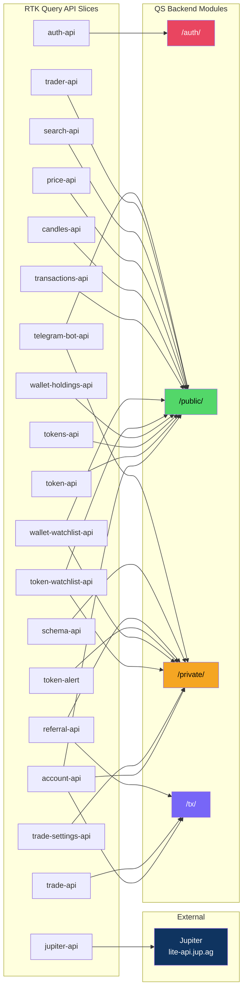

---

## Authentication Flow

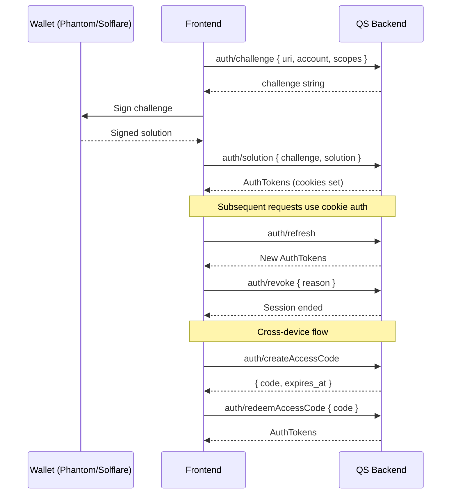

---

## WebSocket Real-Time Data Flow

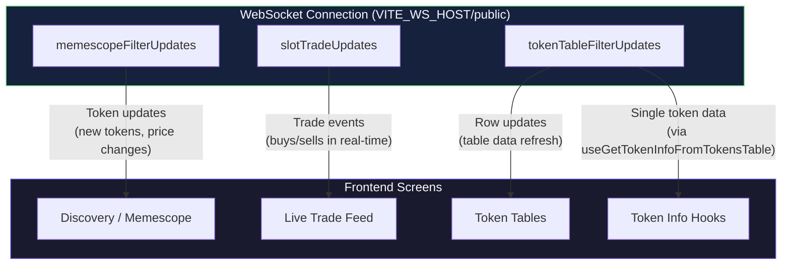

---

## Screen → Data Source Mapping

```mermaid
graph TB
    subgraph Screens["App Screens"]
        DISCOVERY["Discovery Screen"]
        TOKEN_DETAIL["Token Detail"]
        TRADING["Trading Screen"]
        PORTFOLIO["Portfolio / Holdings"]
        TRACKING["Tracking Screen"]
        SEARCH["Search"]
        SETTINGS["Settings"]
    end

    subgraph Data["Data Sources"]
        TI["token-api\ngetLiveTokenInfo"]
        TT["tokens-api\nfilterTokensTable"]
        WH["wallet-holdings-api\ngetAccountTokenHoldings"]
        TP["wallet-holdings-api\ngetTraderPositions"]
        TR["trade-api\nswap / getSwapQuote"]
        TW["token-watchlist-api\ngetAllTokenWatchlists"]
        WW["wallet-watchlist-api\ngetAllWalletWatchlists"]
        TX["transactions-api\nfilterTransactionsTable"]
        CH["candles-api\ngetTokenCandles"]
        PR["price-api\ngetLatestSolPrice"]
        SR["search-api\nsearch"]
        AC["account-api\ngetActiveWallets"]
        TS["trade-settings-api\ngetAccountTradeSettings"]
        JQ["jupiter-api\nswap quote"]
        WS_M["WS: memescopeFilterUpdates"]
        WS_T["WS: slotTradeUpdates"]
        WS_TT["WS: tokenTableFilterUpdates"]
    end

    DISCOVERY --> TT
    DISCOVERY --> WS_M
    DISCOVERY --> WS_TT
    DISCOVERY --> PR

    TOKEN_DETAIL --> TI
    TOKEN_DETAIL --> CH
    TOKEN_DETAIL --> TX
    TOKEN_DETAIL --> WS_T
    TOKEN_DETAIL --> PR

    TRADING --> TR
    TRADING --> JQ
    TRADING --> TS
    TRADING --> WH
    TRADING --> PR

    PORTFOLIO --> WH
    PORTFOLIO --> TP
    PORTFOLIO --> AC
    PORTFOLIO --> PR

    TRACKING --> TW
    TRACKING --> WW
    TRACKING --> WH
    TRACKING --> TP

    SEARCH --> SR
    SEARCH --> TI

    SETTINGS --> AC
    SETTINGS --> TS

    style Screens fill:#1a1a2e,stroke:#7766f7,color:#f8f7fb
    style Data fill:#16213e,stroke:#53d769,color:#f8f7fb
```

---

## Cache Invalidation Map

Shows which mutations invalidate which query caches:

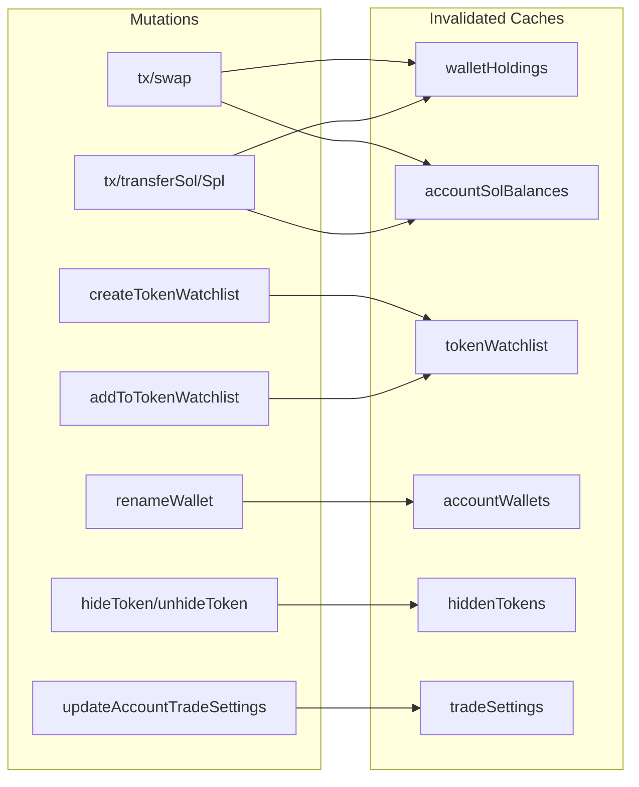

---

## Data Source Summary by Auth Level

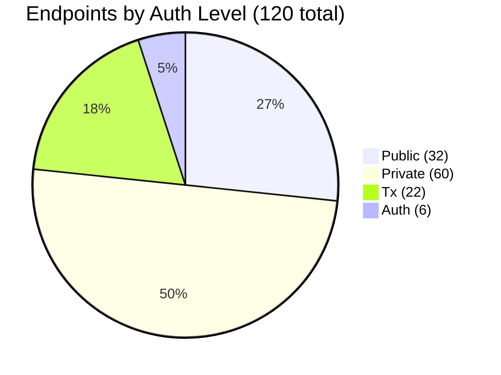

Plus: 3 Jupiter external endpoints, 6 WebSocket channels (5 public + 1 authenticated), Solana RPC, 7 external service integrations.

---

## Backend Microservices Architecture

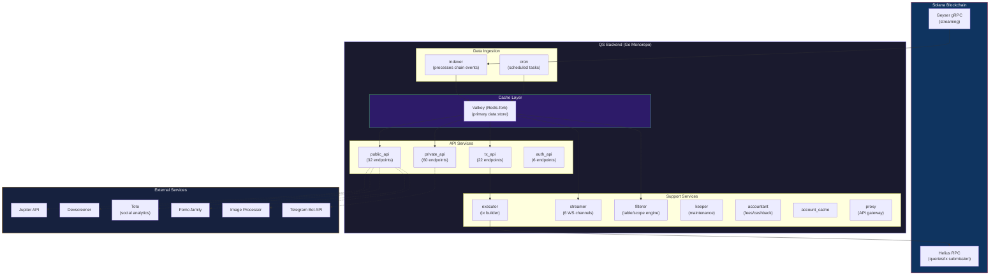

---

## External Service Connections

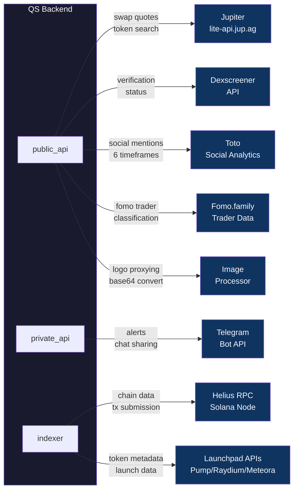

---

## WebSocket Channels (Complete — 6 total)

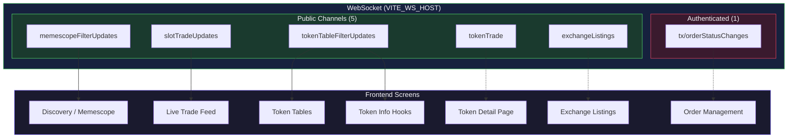

> **Dotted lines** = available but not currently used by the web frontend. iOS app can leverage these directly.

---

## Data Flow: Token Price Update

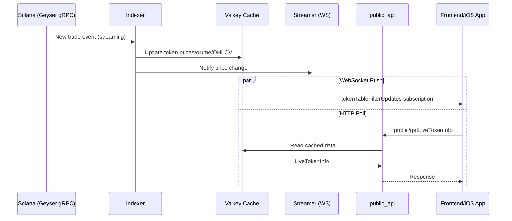

---

## iOS App Priority Mapping

Suggested priority for iOS implementation based on core trading functionality:

### P0 — Must Have (Core Trading Loop)

| Source | Why |
|--------|-----|
| `auth-api` | Login/session management |
| `account-api` (wallets) | Wallet management |
| `token-api` (getLiveTokenInfo) | Token data |
| `trade-api` (swap, quote) | Executing trades |
| `wallet-holdings-api` | Portfolio view |
| `price-api` | SOL price reference |
| `search-api` | Token discovery |
| WebSocket (tokenTableFilterUpdates) | Real-time prices |

### P1 — High Priority (Trading Experience)

| Source | Why |
|--------|-----|
| `candles-api` | Charts |
| `tokens-api` (filterTokensTable) | Token discovery tables |
| `trade-settings-api` | User trade preferences |
| `transactions-api` | Trade history |
| `token-watchlist-api` | Favorites/watchlists |
| `jupiter-api` | Alternative swap routing |
| WebSocket (slotTradeUpdates) | Live trade feed |

### P2 — Medium Priority (Full Feature Set)

| Source | Why |
|--------|-----|
| `wallet-watchlist-api` | Wallet tracking |
| `token-alert` | Price alerts |
| `referral-api` | Referral system |
| `trader-api` | Trader analytics |
| `telegram-bot-api` | Notifications |
| WebSocket (memescopeFilterUpdates) | Memescope |

### P3 — Low Priority / Web-Only

| Source | Why |
|--------|-----|
| `schema-api` | Desktop dashboard layouts |
